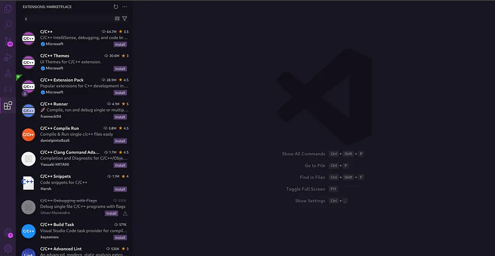

# Conhecendo as ferramentas para programar

Antes de começarmos a explorar a lógica de programação, a 
resolução de problemas e as diversas estratégias de desenvolvimento, 
é fundamental garantir que temos um ambiente adequado para programar 
nossos algoritmos.

Existem diversas linguagens de programação que podemos utilizar, mas 
focaremos em três principais para a introdução ao mundo da programação: 
C, Python e Portugol. Estas linguagens são consideradas amigáveis para 
iniciantes e fornecem uma base sólida para o aprendizado de conceitos 
fundamentais da programação.

- [O que é Portugol?](https://medium.com/@jvf.souza/o-que-%C3%A9-portugol-8f5ac55256bd?source=post_page-----036b590d331e--------------------------------)
- [O que é Python?](https://medium.com/@jvf.souza/o-que-%C3%A9-python-25d57c1a2dd7?source=post_page-----036b590d331e--------------------------------)
- [O que é C](https://medium.com/@jvf.souza/o-que-%C3%A9-c-ae3cacfa8840?source=post_page-----036b590d331e--------------------------------)

### Entendendo um pouco mais sobre o que é uma linguagem de programação

Linguagens de programação são ferramentas que permitem a criação de 
algoritmos de maneira estruturada e compreensível para humanos. 
Esses algoritmos, que são sequências de comandos e instruções, são então 
convertidos para uma linguagem de máquina, possibilitando que o computador 
execute as tarefas solicitadas.

#### Mas como ocorre essa conversão do algoritmo que escrevemos para linguagem de máquina?

Esse trabalho se dá a partir de compiladores e interpretadores. Compiladores 
e interpretadores são ferramentas fundamentais na programação, responsáveis 
por traduzir o código escrito por programadores em linguagem de máquina que os 
computadores podem executar. Um compilador realiza essa tradução de uma só vez, 
convertendo todo o código fonte em um arquivo executável antes da execução. 
Isso geralmente resulta em programas mais rápidos e eficientes. Por outro lado, 
um interpretador traduz e executa o código fonte linha por linha, o que 
facilita o desenvolvimento e a depuração, mas pode levar a uma execução mais 
lenta do programa.

C é uma linguagem compilada, o que significa que o código fonte é traduzido 
para código de máquina executável pelo compilador antes de ser executado. 
Esse processo resulta em um programa que pode ser executado rapidamente e com 
eficiência.

Python, por outro lado, é uma linguagem interpretada. O código fonte é lido e 
executado diretamente pelo interpretador, linha por linha. Embora isso facilite 
o desenvolvimento e a depuração, pode resultar em uma execução mais lenta em 
comparação com um programa compilado.

## Visual Studio Code (VSCode) e Extensões

Visual Studio Code (VSCode) é um editor de código fonte leve, mas poderoso, 
que se tornou extremamente popular entre desenvolvedores. Ele suporta várias 
linguagens de programação através de extensões, o que o torna uma ferramenta 
versátil para programar em C, Python e muitas outras linguagens.

- Extensão Python para VSCode: Esta extensão oferece suporte completo para o 
desenvolvimento em Python, incluindo depuração, linting (análise de código), 
IntelliSense (autocompletar), e integração com notebooks Jupyter. Aqui tem um 
link para como usar o Python em VSCode.
- Extensão C/C++ para VSCode: Fornece suporte para a edição, compilação, e 
depuração de código em C e C++. Com esta extensão, você pode configurar 
facilmente seu ambiente de desenvolvimento para compilar e executar programas 
em C. Outro link sobre como usar o C no VSCode.

As extensões estão disponíveis diretamente no ambiente do VSCode. Assim, 
quando você baixa e instala o editor, pode facilmente adicionar extensões a 
partir do próprio VSCode, sem a necessidade de ferramentas externas.

## Conclusão

Escolher a linguagem e o ambiente de desenvolvimento corretos é crucial para o 
sucesso no aprendizado de programação. C, Python e Portugol oferecem diferentes 
vantagens para iniciantes, desde o controle de baixo nível de C até a 
simplicidade de Python e a intuitividade de Portugol. Visual Studio Code, 
com suas extensões, é uma excelente ferramenta para desenvolver nessas 
linguagens, proporcionando um ambiente rico e eficiente para a codificação.

Explore essas linguagens e ferramentas para encontrar aquela que melhor se 
adapta às suas necessidades e interesses. Com a prática e o estudo, você 
desenvolverá uma compreensão sólida da programação e estará preparado para 
enfrentar desafios mais complexos.
#### Mais Informações

Para mais detalhes sobre cada linguagem, consulte a documentação oficial e os 
tutoriais disponíveis online. Aqui estão alguns links úteis:

- [Site Oficial do Python](https://www.python.org/)
- [Documentação do GCC para C](https://gcc.gnu.org/)
- [Extensão Python para VSCode](https://marketplace.visualstudio.com/items?itemName=ms-python.python)
- [Extensão C/C++ para VSCode](https://marketplace.visualstudio.com/items?itemName=ms-vscode.cpptools)

